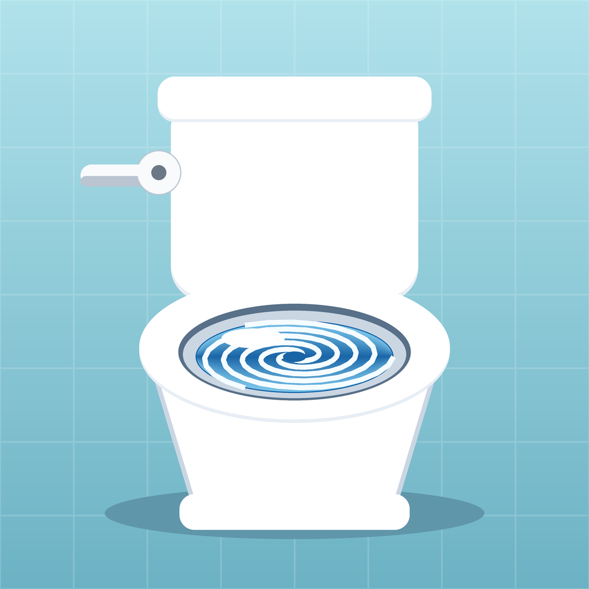

# Flush Simulator

An iOS app that is a picture of a toilet. You push the handle. It flushes.

That is the entire feature set.

<p align="center">
  
</p>

## Running it

Open `FlushSimulator.xcodeproj` in Xcode 16 or newer, pick a simulator or your
phone, and press Run. iOS 17+. No packages, no dependencies, no setup.

To run it on a real device, set your team under **Signing & Capabilities** and
change the bundle identifier from `com.example.FlushSimulator` to something of
your own.

## What actually happens when you push the handle

- The lever slams down and springs back.
- The bowl **surges** first — it always looks like it's going to overflow — then
  drains to nothing, swirling about four and a half times on the way down.
- Foam and bubbles spiral into the drain and disappear.
- The whole fixture rumbles, in your hand as well as on screen.
- The tank hisses as it refills, and the water settles back to where it started.
- The app says something about your performance.

Then there are the extras that make it worth doing twice:

- **A running tally**, kept between launches.
- **Ranks**, from Bathroom Rookie up to Their Royal Flushness at a thousand
  flushes, with a progress bar so you know how far you have left to fall.
- **Golden flushes.** One in twenty. The whole app turns gold, gold falls from
  the sky, and the sound gets a small fanfare.
- **Commentary**, which never repeats the same line twice in a row.
- **Milestone lines** at the round numbers.
- Mash the handle mid-flush and it will tell you to settle down.

Press and hold the stats card to wipe your record, if you can bring yourself to.

## How it's built

Roughly 1,200 lines of SwiftUI, no third-party anything.

**The toilet is drawn, not drawn on.** No image assets — it's SwiftUI shapes and
gradients laid out in a fixed 320×470 design space and scaled to fit, so the
proportions hold from an SE to an iPad without a single layout calculation.

**One flush is a set of pure functions of elapsed time** (`FlushTimeline.swift`).
Water level, rotation, turbulence, handle angle and rumble are all `f(t)`. The
drawing samples them every frame inside a `TimelineView`, and the engine schedules
sound and haptics against the same numbers, so the picture and the noise can't
drift apart. It also means the flush can be scrubbed to any point, and that the
first and last frames land exactly on the resting state.

**The sound is synthesised at launch** (`FlushAudio.swift`), not recorded. A
recording would mean shipping a binary blob nobody can read; instead there's a
clunk off the handle, a roar of band-passed noise whose centre frequency sweeps
from 1250 Hz down to 370 Hz as the bowl empties, a gurgle wobbling underneath it,
and the long rising hiss of the tank refilling. Takes are rendered whole into
buffers on a background queue, so none of that arithmetic goes anywhere near the
audio render thread. Three seeded variants play at random so the same noise never
repeats back to back.

The session uses the `.ambient` category: the ringer switch still means something,
and your music keeps playing. There's a mute button in the corner too.

**Haptics are a real pattern**, not a single buzz — a sharp transient for the
lever, then a continuous rumble with an intensity curve that swells and fades
with the water (`Haptics.swift`). Falls back to a plain impact where CoreHaptics
isn't available, and stays quiet where nothing is.

**Nothing animates while nothing is happening.** At rest, only the pool keeps a
clock, at twelve frames a second, for a shimmer. The porcelain — with its blurs
and shadows — is static until you touch the handle.

### Files

| | |
|---|---|
| `FlushTimeline.swift` | One flush, as pure functions of time |
| `FlushEngine.swift` | State, the tally, and what the app says to you |
| `ToiletView.swift` | The fixture, and the only control in the app |
| `WaterCanvas.swift` | Pool, vortex, foam, bubbles |
| `FlushAudio.swift` | Noise synthesis and playback |
| `Haptics.swift` | The rumble |
| `Palette.swift` | Every colour, twice — ordinary and golden |
| `Rank.swift`, `Quips.swift` | Unearned titles and running commentary |
| `Tools/make_icon.py` | Draws the app icon |

### The icon

Generated, so it can be reviewed as code and redrawn after a palette change:

```sh
pip install pillow
python3 Tools/make_icon.py
```

## Accessibility

The handle is a labelled button with a generous target, it works with VoiceOver,
and the whole app reads correctly in light and dark mode.
